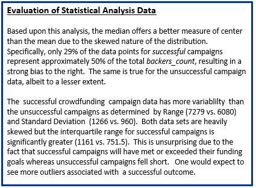

**UCB Data Analysis Module 1**
## Excel Challenge: Crowdfunding Campaign Project

---------------
#### Purpose:
Organize and analyze a database of 1,000 sample projects to discover hidden trends using conditional formatting, built-in formulas, pivot tables and pivot charts.  

(sample pivots x2)  
  
  

(sample pivot table)  
  

(statistical analysis)  
  

SUMMARY OUTCOME  

--------------
#### Contents of Repository:
- 1 x Excel notebook (CrowdfundingBook_rjh.xlsx)
- 1 x Analytical Report (Analysis of Crowdfunding Campaign Project.docx)
- 1 x README file

-------------------
#### Contributions:  
Box plot tools courtesy of [Alcula](http://www.alcula.com/calculators/statistics/box-plot/)

------------------
#### License:
[MIT](https://choosealicense.com/licenses/mit/)

